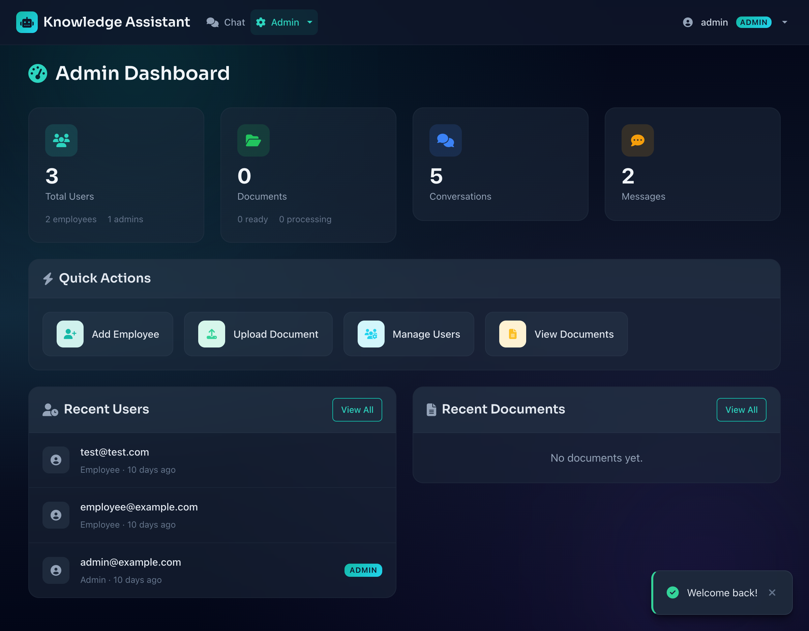

# Organization Knowledge Chatbot

Internal RAG-based knowledge assistant for organizations. Employees ask questions in natural language; the assistant retrieves the right passages from your uploaded documents and generates a grounded, cited answer via Google Gemini.

> _"What's our remote work policy?"_
> _"How do I submit an expense report?"_
> _"Which categories of leave qualify for the legal-team approval flow?"_

Built on Ruby on Rails 7.1, Hotwire/Turbo, PostgreSQL with [pgvector](https://github.com/pgvector/pgvector), Sidekiq, and the Gemini API via [ruby_llm](https://github.com/crmne/ruby_llm).

---

## Screenshots

### Admin Dashboard

At-a-glance counts (users, documents, conversations, messages), quick actions, and recent activity.



## Highlights

- **RAG pipeline** — parse PDF/DOCX/TXT → 512-char chunks → Gemini embeddings → pgvector cosine similarity → Gemini Flash for generation.
- **Real-time streaming** — Turbo Streams broadcast LLM tokens to the chat UI as they arrive, throttled at 100 ms.
- **Dual authentication** — Devise for employees; separate session-timeout-aware admin path at `/admin/login` with constant-time password comparison and per-IP/per-email rate limiting.
- **Audit logging** — every CRUD on admin-managed resources captured in `admin_audit_logs` with IP, user-agent, and request_id.
- **Production-grade observability** — Sentry, lograge JSON logs, Sidekiq Web UI (admin-gated), `/health/deep` readiness probe, Rack::Attack throttles backed by Redis.
- **Hardened security** — magic-byte upload validation (Marcel-sniffed), CSP with nonces and no `unsafe-inline`, last-admin protection, mass-assign-proof role changes.

---

## Tech stack

| Layer              | Choice                                  | Notes                                                      |
| ------------------ | --------------------------------------- | ---------------------------------------------------------- |
| Framework          | Rails 7.1                               | EOL 2025-10-01 — see PRD §6 for the 7.2 upgrade item.     |
| Ruby               | 3.3.5                                   | pinned via `.ruby-version`                                 |
| Database           | PostgreSQL 15+ with `pgvector`          | Cosine similarity; pure-Ruby fallback when extension absent. |
| Vector dimensions  | 768 (Gemini `gemini-embedding-001`)     | Configurable via `EMBEDDING_MODEL`                         |
| Cache & queues     | Redis                                   | Single `REDIS_URL`; namespaced for cache vs. Sidekiq.      |
| Background jobs    | Sidekiq 8                               | Weighted queues; Web UI mounted at `/admin/sidekiq`.       |
| Auth (employee)    | Devise + Lockable                       | Strong-password validator, pepper, generic error messages. |
| Auth (admin)       | Custom, Devise-backed                   | 30-min sliding session timeout, audit-logged login/logout. |
| Frontend           | Hotwire (Turbo + Stimulus), Bootstrap 5 | Importmap (no Node build step).                            |
| Error reporting    | Sentry                                  | Opt-in via `SENTRY_DSN`; PII scrubbed by `before_send`.    |
| Structured logs    | lograge                                 | JSON, request_id-tagged, includes `user_id` in payload.    |
| Rate limiting      | Rack::Attack + Fail2ban                 | Throttles on login, uploads, bulk uploads.                 |

---

## Quick start

### Prerequisites

- Ruby 3.3.5 (`.ruby-version` is honored by rbenv/asdf/chruby)
- PostgreSQL 15+ with the `pgvector` extension
- Redis (for Sidekiq, Rails.cache, and Rack::Attack throttle counters)
- A Gemini API key — get one at [aistudio.google.com](https://aistudio.google.com/app/apikey)

### Setup

```bash
git clone https://github.com/mandilkhadka/organization-chatbot.git
cd organization-chatbot

bundle install
cp .env.example .env                # fill in GEMINI_API_KEY, DATABASE_URL, etc.

# Enable pgvector once per database
psql "$DATABASE_URL" -c "CREATE EXTENSION IF NOT EXISTS vector;"

bin/rails db:prepare
bin/rails admin:create               # interactive admin seeder; or seed via rails c

bin/dev                              # Procfile.dev: web + sidekiq + livereload
```

Visit <http://localhost:3000>. Sign in at `/users/sign_in` (employee) or `/admin/login` (admin).

### Running tests

```bash
bin/rails test                       # full Minitest suite (parallel)
bin/rails test test/services         # subset
bin/rails test:system                # Capybara/Selenium system tests
bundle exec rubocop                  # lint
bundle exec brakeman -q              # security scan
```

---

## Architecture

### Document ingestion

```
Upload (Active Storage, Marcel-sniffed)
   │
   ▼
DocumentProcessorJob ─┐
   │                  │ enqueued per chunk
   ▼                  ▼
TextChunkerService   EmbeddingJob ──► Gemini embeddings API
   │                  │
   ▼                  ▼
document_chunks rows (content + embedding vector(768))
   │
   ▼
status = "ready"
```

### Chat request

```
User message
   │
   ▼
Conversation#create_message ─► GenerateResponseJob.perform_later
                                        │
                                        ▼
                          ┌── VectorSearchService ──► pgvector
                          │           │
                          │           ▼
                          │   relevant chunks (top-k)
                          │           │
                          └──► RagService.build_prompt
                                        │
                                        ▼
                                Gemini Flash (stream)
                                        │
                                        ▼
                Turbo::StreamsChannel.broadcast_replace_to
                                        │
                                        ▼
                                Live chat UI
```

### Health endpoints

| Path           | Purpose             | Returns                                         |
| -------------- | ------------------- | ----------------------------------------------- |
| `/up`          | Liveness            | `200 {status:"ok"}` if Rails booted.            |
| `/health`      | Liveness (alias)    | Same as `/up`.                                  |
| `/health/deep` | Readiness           | `503` unless Postgres + Redis are both healthy. |

Set `HEALTH_CHECK_GEMINI=true` to include a Gemini auth probe in `/health/deep`.

---

## Operations

### Sidekiq Web UI

Mounted at **`/admin/sidekiq`**. Auth is enforced via a route-level Warden constraint that requires `admin?` and a non-expired admin session. Anonymous and employee users get a 404 from the routes layer — Sidekiq Web itself is never reached.

### Error reporting (Sentry)

Set `SENTRY_DSN` in production. The initializer (`config/initializers/sentry.rb`):

- enables itself only in `production`/`staging`
- scrubs `Authorization`, `Cookie`, and a list of sensitive form fields via `before_send`
- excludes `ActionController::RoutingError` and `ActiveRecord::RecordNotFound` from noise
- samples traces at 5% by default (`SENTRY_TRACES_SAMPLE_RATE`)

### Structured logging

`config/initializers/lograge.rb` enables JSON request logs everywhere except development. Each line includes `request_id`, `remote_ip`, `user_id`, sanitized params, and exception class/message. Sidekiq inherits the request_id via Sentry breadcrumbs.

### Caching

Production uses `:redis_cache_store`. **This is required**, not optional: Rack::Attack throttles, fragment caching, and idempotency keys all share `Rails.cache`. A null cache store would silently disable rate limiting. The dev cache stays `:null_store` by default; toggle it with `bin/rails dev:cache`.

### Mail

SMTP is configured via `SMTP_ADDRESS`, `SMTP_PORT`, `SMTP_USERNAME`, `SMTP_PASSWORD`, `SMTP_AUTHENTICATION`, `SMTP_DOMAIN`, `MAILER_SENDER`. All Devise mailers ship with a custom branded layout and a plaintext sibling.

---

## Environment variables

See [`.env.example`](.env.example) — it groups variables into **Required**, **Production-required**, **Observability**, and **Tuning knobs** with concise comments on each.

---

## Roadmap

The full backlog with severity and rationale lives in [PRD.md](PRD.md). The biggest open items:

- **Rails 7.2 upgrade** (Rails 7.1 reached EOL on 2025-10-01 — Brakeman flags this on every run).
- **System & integration tests for the streaming chat path** — coverage is currently ~47%, the chat pipeline has zero end-to-end coverage.
- **i18n externalization** — every flash and view string is hardcoded English; Japanese audience signals point to a `ja.yml` sibling.
- **Deploy target** — Dockerfile is ready; pick Kamal / Fly.io / Render and check in the config.
- **2FA for admin** — TOTP via `devise-two-factor` would round out admin hardening.

---

## Reference docs

- [PRD.md](PRD.md) — prioritized remediation plan with severity, rationale, and verification checklist.
- [SPEC.md](SPEC.md) — original architectural specification.
- [CLAUDE.md](CLAUDE.md) — guidance for AI assistants working in this repo.
- [AUDIT-REPORT.md](AUDIT-REPORT.md) — initial security audit findings.
- [SECURITY-FIXES.md](SECURITY-FIXES.md) — log of security fixes applied.
